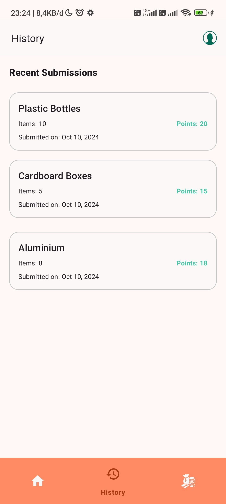

<div align="center">
    <h1>Recycly</h1>
</div>

## Installation
Clone the repository or Download the zip & Open it into Android Studio
```bash
git clone https://github.com/Recycly-project/md_work_space.git -b main
```

## App Preview
<div style="overflow-x: auto; white-space: nowrap;">
    
    
    
    
    
    
    
</div>

## Dependencies
- [Lifecycle & Livedata](https://developer.android.com/jetpack/androidx/releases/lifecycle): Observing Android component lifecycles and managing continuous data flow.
- [ViewModel](https://developer.android.com/topic/libraries/architecture/viewmodel): Storing and managing UI-related data in a lifecycle-conscious way.
- [Retrofit 2](https://square.github.io/retrofit/): Making HTTP requests to RESTful APIs in a simple and efficient way on Android.
- [OkHttp 3](https://square.github.io/okhttp/): Efficient and reliable HTTP client for Android, used by Retrofit for making HTTP network calls.
- [AndroidX](https://mvnrepository.com/artifact/androidx): Package of libraries and tools that provide a range of features for Android app development.
- [KotlinX Coroutines](https://developer.android.com/kotlin/coroutines): Kotlin library for writing asynchronous code in a clean, sequential style.
- [DataStore](https://developer.android.com/topic/libraries/architecture/datastore): Replaces SharedPreferences, providing a secure and asynchronous data storage system using a standard protocol.
- [ViewBinding](https://developer.android.com/topic/libraries/view-binding): Allows binding of Android UI components to code via the IDs present in layout files.
- [CameraX](https://developer.android.com/media/camera/camerax): CameraX is a Jetpack library, built to help make camera app development easier. For new apps, we recommend starting with CameraX. It provides a consistent, easy-to-use API that works across the vast majority of Android devices, with backward-compatibility to Android 5.0 (API level 21).
- [Navigation](https://developer.android.com/guide/navigation): Navigation refers to the interactions that let users navigate across, into, and back out from the different pieces of content within your app.
- [KTLoading Button](https://github.com/timonknispel/KTLoadingButton): Simple loading button for kotlin andorid apps.